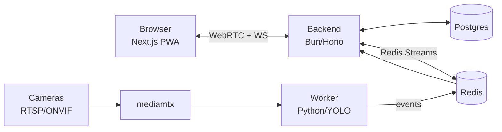

# Oversight

A self-hosted, open-source video surveillance system — real-time detection,
recording, rules, and notifications, on your own hardware.

[](LICENSE)


---

## Features

- **Event recording + playback** — every detection is saved as a short clip
  with pre-roll, browsable from the Recordings view.
- **Zone & class rules** — draw zones on a camera and trigger alerts on
  specific object classes entering them.
- **Object tracking** — multi-object tracking (ByteTrack) powers tripwire
  (line-crossing) and dwell (loitering) detection.
- **Notifications** — webhook, ntfy, Telegram, Pushover, and web push, each
  alert delivered with a detection snapshot image.
- **Auto-reconnect + camera health** — cameras reconnect automatically with
  backoff, report live health, and can raise offline/recovery alerts.
- **ONVIF network discovery** — scan your LAN for ONVIF cameras and
  auto-fill the RTSP URL instead of typing it by hand.
- **Durable event pipeline** — detections and clips flow through Redis
  Streams with a consumer group, so a backend or Redis restart doesn't drop
  events.

---

## Quickstart

```bash
git clone https://github.com/SamarS1ngh/oversight oversight && cd oversight
./install.sh
# open http://localhost:3000  (login printed by the installer)
```

Requires Docker + Docker Compose v2, on a **Linux host** (recommended). The
detection worker runs with host networking so the browser can reach its WebRTC
ICE candidates for live video — on Docker Desktop (macOS/Windows) host
networking differs, so the live stream may need extra configuration. `install.sh`
generates secrets into `.env` on first run and brings the stack up with
`docker compose up -d --build`.

---

## Architecture



The frontend talks to the backend over WebRTC (live video) and WebSocket
(events/state). The Python worker pulls RTSP from cameras via mediamtx, runs
YOLOv8n detection + ByteTrack tracking, records clips, and publishes
detections/clips onto Redis Streams, which the backend consumes durably and
fans out to the UI and notification channels.

---

## Configuration

Full list in [`.env.example`](.env.example). Key variables:

| Variable | Default | Meaning |
|---|---|---|
| `JWT_SECRET` | *(generated by `install.sh`)* | Signing secret for auth tokens |
| `APP_URL` | `http://localhost:3000` | Frontend URL used in notification links |
| `PUBLIC_API_URL` | `http://localhost:8080` | Backend's externally-reachable URL (snapshot links) |
| `PRE_ROLL_S` | `10` | Seconds of footage kept before a trigger |
| `POST_ROLL_S` | `10` | Seconds recorded after the last trigger |
| `RETENTION_DAYS` | `7` | Delete clips older than this |
| `OFFLINE_GRACE_S` | `60` | Seconds without frames before a camera is marked offline |
| `STALL_TIMEOUT_S` | `10` | Seconds without frames before a reconnect attempt starts |
| `VAPID_PUBLIC_KEY` / `VAPID_PRIVATE_KEY` | *(empty)* | Web push keys — generate with `make vapid` (or `bun run backend/scripts/gen-vapid.ts`); web push is off until set |
| `VAPID_SUBJECT` | `mailto:admin@example.com` | Contact URI required by the web-push spec |
| `STREAM_MAXLEN` | `10000` | Max entries kept per Redis stream before trimming |
| `MAX_DELIVERIES` | `5` | Max delivery attempts before an event is dead-lettered |

---

## Tech stack

- **Frontend** — Next.js 15 / React 19
- **Backend** — Bun + Hono, Drizzle ORM on Postgres
- **Event pipeline** — Redis Streams
- **Worker** — Python, PyAV, OpenCV, YOLOv8n (Ultralytics), ByteTrack (`supervision`)
- **Media** — mediamtx (RTSP ingest/relay), WebRTC for browser playback

---

## License

Oversight is licensed under the [GNU AGPL-3.0](LICENSE).

In plain English: you're free to use, self-host, and modify it. But if you
run a *modified* version of Oversight as a network service for others, you
must make the source of your modified version available to those users.
Unmodified self-hosted use has no such obligation.
